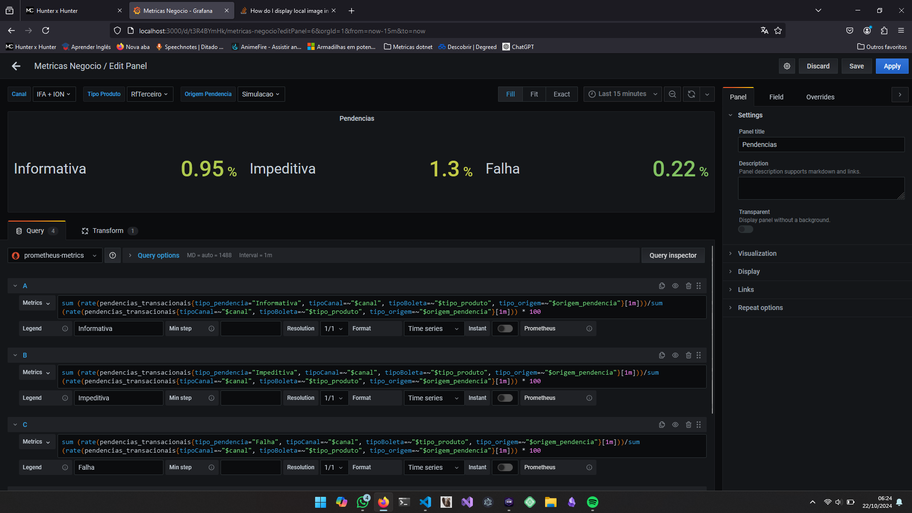

https://medium.com/guide-lab/monitoramento-prometheus-grafana-e-net-core-3-1-parte-1-63a43b845e9f
https://medium.com/guide-lab/monitoramento-prometheus-grafana-e-net-core-3-1-parte-2-5f1c590b6c7f
https://medium.com/guide-lab/monitoramento-prometheus-grafana-e-net-core-3-1-parte-3-d8c3d4ae88bd
https://github.com/dgmodesto/webapimetrics-grafana-prometheus/tree/feature/grafana

https://blog.4linux.com.br/primeiros-passos-com-promql/


PromQl simples de um Counter
- `sum(increase(BoletasCriadas[1m])) by (tipoBoleta)`

Consulta utilizando váriaveis do grafa
- `sum(increase(BoletasCriadas{tipoCanal=~"$canal", tipoBoleta=~"$tipo_produto"}[1m])) by (tipoBoleta, tipoCanal)`

Consulta tipo table exemplo:
- `topk(3, sum(increase(pendencias_transacionais{tipo_pendencia="Falha",tipoCanal=~"$canal", tipo_origem=~"$origem_pendencia"}[$__range])) by (tipoBoleta))`


Consulta tipo percentual de um total:
- `sum (rate(pendencias_transacionais{tipo_pendencia="Informativa", tipoCanal=~"$canal", tipoBoleta=~"$tipo_produto", tipo_origem=~"$origem_pendencia"}[1m]))/sum (rate(pendencias_transacionais{tipoCanal=~"$canal", tipoBoleta=~"$tipo_produto", tipo_origem=~"$origem_pendencia"}[1m])) * 100`


Consulta tipo totais:
- `sum(increase(pendencias_exibidas{tipoCanal=~"$canal", tipoBoleta=~"$tipo_produto", tipo_origem=~"$origem_pendencia", tipo_pendencia!="Ok"}[1m])) by (tipo_origem, tipo_pendencia)`


Criação de variavel com valores dinamicos:
- `label_values(BoletasCriadas, tipoBoleta)`


Subir compose inteiro
```bash
podman-compose --file docker-compose.yml up --detach
```

Re-criar container da api com as atualizações do projeto
```bash
podman-compose --file docker-compose.yml up --detach --build api
```

topk(3,
  sum(rate(pendencias_transacionais{tipo_pendencia="Falha", tipoCanal=~"$canal", tipoBoleta=~"$tipo_produto", tipo_origem=~"$origem_pendencia"}[1m])) by (tipo_produto)
  /
  sum(rate(pendencias_transacionais{tipoCanal=~"$canal", tipoBoleta=~"$tipo_produto", tipo_origem=~"$origem_pendencia"}[1m])) by (tipo_produto)
)

Lista pacotes desatualizados:
dotnet list package --outdated --format json

Lista pacotes para analise se está configurado as libs necessárias
dotnet list package --format json